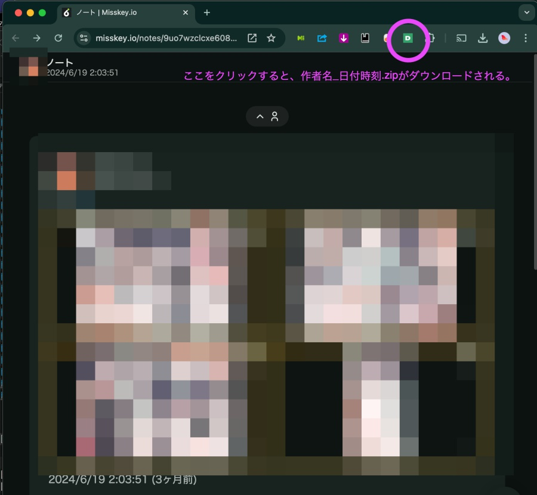

# chrome-ex-misskey-download-zipped-images

Misskeyのページ詳細画面から、画像を、作者のIDを含むファイル名のzipとしてダウンロードさせるChromeアドオン

## つまりどういう事？

Misskey.ioなどで、画像つきの投稿をタブで開く。そうしたら、ツールバーの「D」ボタンを押す。

すると、表示されている画像をまとめたzipファイルが勝手にダウンロードされる。

あとは、zip画像に対応したマンガビューアーなり、MacOSならプレビューするなり、お楽しみください。
