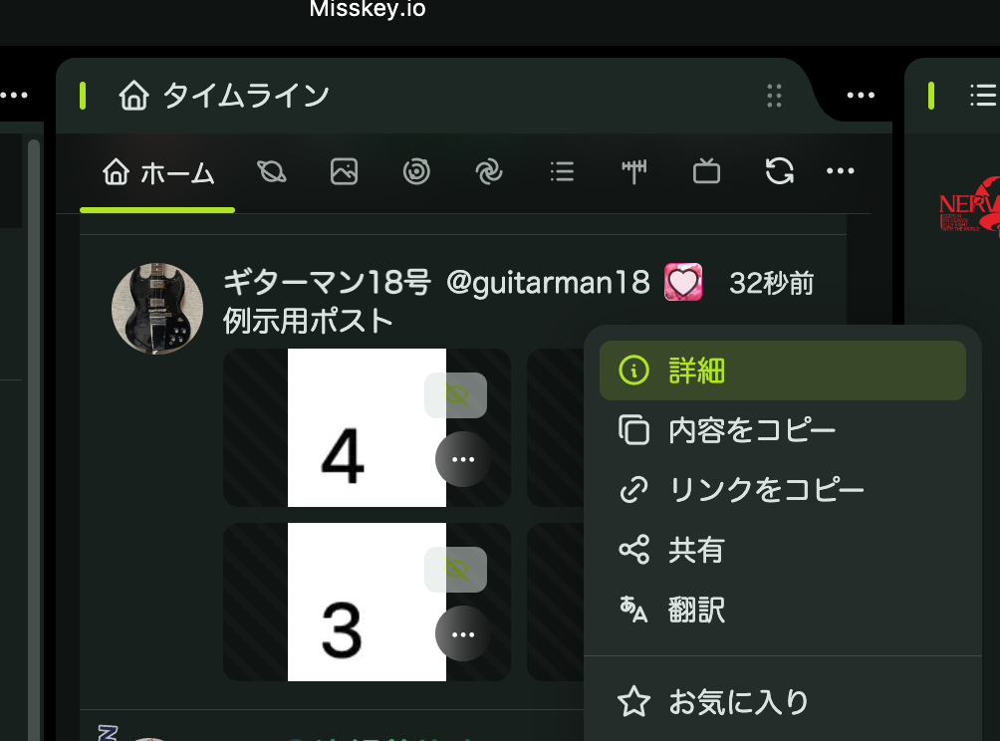
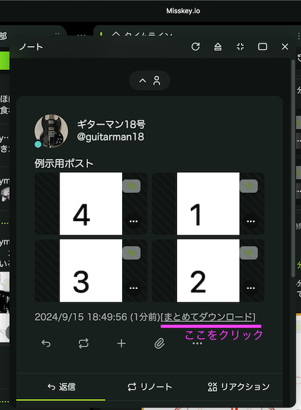
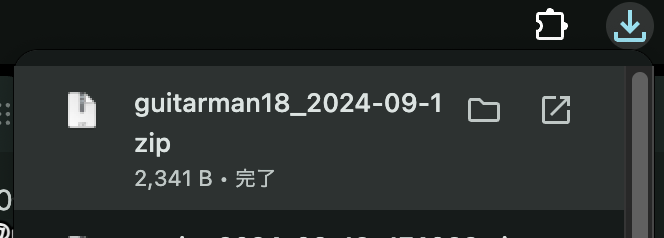
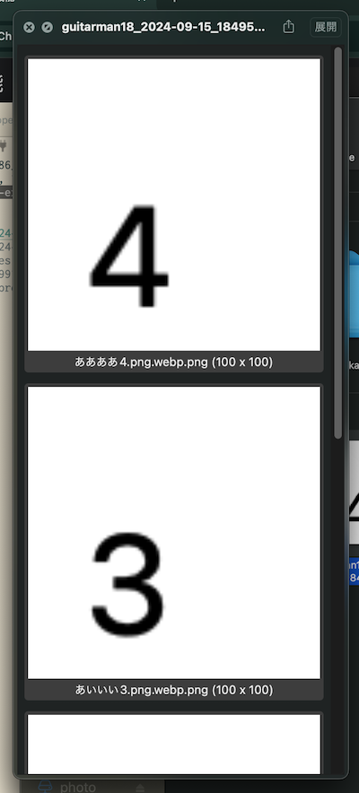

# chrome-ex-misskey-download-zipped-images

Misskeyのページ詳細画面から、画像を、作者のIDを含むファイル名のzipとしてダウンロードさせるChromeアドオン

※デッキUI限定です。

## 使い方 その1

Misskey.ioなどで、デッキUIを表示する。

画像が添付されたノート右上の「詳細」をクリックして、ウインドウが開く。

ウインドウをスクロールしてタイムスタンプ部分を見ると、[まとめてダウンロード]というリンクが出現するので、押す。

すると、作者名とアップロード日がファイル名に入ったzipファイルが自動的にダウンロードされる。

zipファイルの中身をプレビューすると、画像がちゃんと入っている。

## 使い方 その2

Misskey.ioなどで、デッキUIを表示する。

画像つきの投稿を「新しいタブで開く」。そうしたら、ツールバーの「D」ボタンを押す。

すると、表示されている画像をまとめたzipファイルが勝手にダウンロードされる。

あとは、zip画像に対応したマンガビューアーなり、MacOSならプレビューするなり、お楽しみください。

## 既知の不具合

アニメーションGIF画像がうまく保存できない。直し方わからないので、わかったら教えてください。
